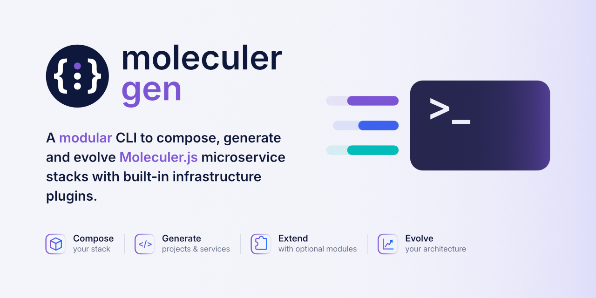
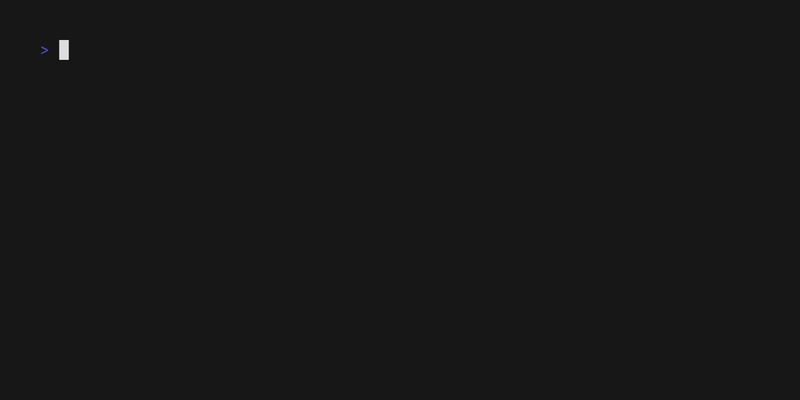

<div align="center">
  
</div>

<br />

<div align="center">

  [](https://github.com/AssilemSDN/moleculer-gen/actions/workflows/ci.yml)
  [](https://codecov.io/github/AssilemSDN/moleculer-gen)
  
  
  [](./LICENSE)
</div>


# { } moleculer gen

A **modular platform engineering CLI** for scaffolding and extending ready-to-run [Moleculer.js](https://moleculer.services/) microservice projects with Docker Compose and composable infrastructure modules.

Choose your database, message transporter, and optional infrastructure modules, then evolve the generated project as your architecture grows.

```bash
npx moleculer-gen init
```

> **No global installation required.**

## 🎬 Demo 
### From zero to a generated microservice stack

`moleculer-gen` can generate a complete local microservice environment, add application services, and get the stack ready to run without forcing the project into a proprietary structure.


The demo shows the interactive workflow:

- initialize a new project
- select the infrastructure modules
- add a CRUD service
- add multiple services from configuration

### Reproduce the stack from configuration

Interactive prompts are useful while designing a stack, but the same project can also be generated non-interactively from JSON configuration files.



The demo configurations are available here:

- [`init`](./examples/config/init-project/demo.json)
- [`add-service`](./examples/config/add-service/demo.json)
- [`add-services`](./examples/config/add-services/demo.json)

---

> [!NOTE]
> The demo uses a full configuration to showcase the available modules.
> Traefik and Prometheus are optional.

> [!TIP]
> Want to inspect the generated result without running the CLI?
> A complete demo project is available [here](https://github.com/AssilemSDN/moleculer-gen-demo).

## Why moleculer-gen?

`moleculer-gen` is designed for developers who want a **fast, modular, and lightly opinionated foundation** for building Moleculer.js microservices with Docker.

It aims to avoid two extremes:

* rebuilding the same development infrastructure for every project;
* adopting a heavy platform that becomes harder to modify than the application itself.

The generated project remains a **standard Moleculer.js project** — `moleculer-gen` handles the repetitive scaffolding without locking the application into a proprietary project format.

**Start small. Add infrastructure as your architecture evolves.**

## 🚀 Quick start

### Requirements


| Requirement                                        | Version                            | Purpose                          |
| -------------------------------------------------- | ---------------------------------- | -------------------------------- |
| [Node.js](https://nodejs.org/)                     | `22.22.2+`, `24.15.0+`, or `26+`   | Run the CLI                      |
| [Docker](https://www.docker.com/)                  | `>= 24`                            | Run generated services           |
| [Docker Compose](https://docs.docker.com/compose/) | `v2+`                              | Orchestrate the generated stack  |
| [Make](https://www.gnu.org/software/make/)         | Recent version                     | Build and manage the environment |

### Create a project

Run the CLI from the directory where you want the project folder to be created:

```bash
npx moleculer-gen init
```
The interactive setup lets you choose the infrastructure required by your project.


Then enter the generated project directory and start the stack:
```bash
cd ./<generated-project-directory>
make build
make start
```

You can also skip the interactive prompts and use a JSON configuration file for reproducible generation:

```bash
npx moleculer-gen init ./project.config.json
```

> See the example [`init`](./examples/config/init-project/) configurations for the supported format.

### Extend the project

Add a service interactively:

```bash
npx moleculer-gen add-service
```

Or add a service from configuration:

```bash
npx moleculer-gen add-service ./service.config.json
```

> See the example [`add-service`](./examples/config/add-service/) configurations for the supported format.

Or generate multiple services from configuration:

```bash
npx moleculer-gen add-services ./services.config.json
```

> See the example [`add-services`](./examples/config/add-services/) configurations for the supported format.

## Modular by design

`moleculer-gen` is built around independent modules that can be composed when creating a project.

### Currently supported

| Category       | Module      |
| -------------- | ----------- |
| Database       | MongoDB     |
| Transporter    | NATS        |
| Backend        | API Gateway |
| Infrastructure | Traefik     |
| Observability  | Prometheus  |

Optional infrastructure modules are only included when selected during initialization.

This keeps generated environments focused while allowing `moleculer-gen` to evolve with additional databases, transporters, and infrastructure integrations.


## 🧰 CLI overview

```text
npx moleculer-gen [options] [command]
```

| Command                                               | Mode                 | Description                                     |
| ----------------------------------------------------- | -------------------- | ----------------------------------------------- |
| [`init`](./docs/cli/commands/init.md)                 | Interactive / config | Initialize a new Moleculer.js project           |
| [`add-service`](./docs/cli/commands/add-service.md)   | Interactive / config | Add one service to an existing project          |
| [`add-services`](./docs/cli/commands/add-services.md) | Config               | Add multiple services from a JSON configuration |
| [`validate`](./docs/cli/commands/validate.md)         | Validation           | Validate the project configuration              |

Generation commands support dry runs, allowing changes to be inspected before files are written.

For global options, configuration files, and command usage, see the [`CLI reference`](./docs/cli/README.md).

## 📚 Documentation

The README is intentionally focused on discovering `moleculer-gen` and getting a project running quickly.

* [`CLI reference`](./docs/cli/README.md) — commands, options, configuration files, and dry runs
* [`Demo development`](./docs/demos/README.md) — reproduce and maintain the project demos


## 🤝 Contributing

Contributions, bug reports, and feature proposals are welcome.

See [`CONTRIBUTING.md`](./CONTRIBUTING.md) for development setup and contribution guidelines.

## Security

For vulnerability reporting and security-related information, see [`SECURITY.md`](./SECURITY.md).

## License

`moleculer-gen` is distributed under the [MIT License](./LICENSE).
